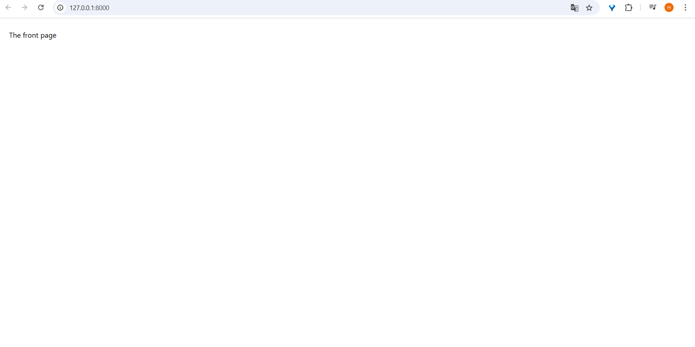

# Step_0 actions
## activate the virtual env
```
 venv\Scripts\activate 
```
##  cd in the global configurations folder
```
 cd puddle
```
# Creating a new django app named core
```
python manage.py startapp core
```
It will create a new folder named core as puddle subfolder it should look like this :
 Répertoire : C:\logiciels_et_projets\puddle\puddle\core


         Length Name          Description 
         -------------         ------ ----          
            migrations        migrations folder
            66 admin.py       database models use in django admin page
            146 apps.py       a configuration file
            60 models.py      models folder
            63 tests.py       what we run to make a test
            66 views.py       views folder
            0 __init__.py
##  add 'core' apps in INSTALLED_APPS, 
go in puddle/setting.py and add it, it should look like :
```
INSTALLED_APPS = [
    'django.contrib.admin',
    'django.contrib.auth',
    'django.contrib.contenttypes',
    'django.contrib.sessions',
    'django.contrib.messages',
    'django.contrib.staticfiles',
    'core',
]
```
# let's implements our first app
## our first view: index.html
go in core/views.py and add the following code :
```
def index(request):
        return render(request, 'core/index.html')
        

```
>Note: When you initialize a local git repository you should create an	empty new file at least (example the standard	README.md).
Pushing an empty repository does'nt work.
## create the template folder
core/templates
>Note:Django automatically search it for registered apps when render() is called
and create inside template this path: core/index.html

add the following code to index.html:
```
<!DOCTYPE html>
<html lang="en">
<head>
    <meta charset="UTF-8">
    <!--to make the website mobile friendly-->
    <meta name="viewport" content="width=device-width, initial-scale=1.0"> 
    <!--add tailwind as cdn-->
    <script src="https://cdn.tailwindcss.com"></script>
    <title>Puddle</title>

</head>
<body>
    <!--px and py are margin classes-->
    <div class="px-6 py-6">
        <h1>The front page</h1>
    </div> 
</body>
</html>
```
## adding index.html url:
go in puddle/urls.py
modifiy to obtain the following code : 

 ```
from django.contrib import admin
from django.urls import path

from core.views import index " Add the import of your ui code"

urlpatterns = [
    path('', index,name='index'),
    path('admin/', admin.site.urls),
]
```
> Note :path('', index,name='index'), this line means : 
    " set the path to empty: this is the default homepage, we want to use a view called index, and name the route index"

## run django server to see if everything is Okay : 
go to the root of the prjct : the puddle floder and run 
```
python manage.py runserver
```
follow the link, you should obtain the following page instead of the default django_welcome_page:

## create a file called \templates\core\base.html
the new code of the index.html file will be :
```
    

    welcome

    
        <h1>The front page </h1>
    
```
Et le code de de base.html
```
<!DOCTYPE html>
<html lang="en">
<head>
    <meta charset="UTF-8">
    <!--to make the website mobile friendly-->
    <meta name="viewport" content="width=device-width, initial-scale=1.0"> 
    <!--add tailwind as cdn-->
    <script src="https://cdn.tailwindcss.com"></script>
    <title> | puddle</title>
    
</head>
<body>
     <!--px and py are margin classes-->
     
        <nav class="px-6 py-6 flex justify-between items-center border-b border-gray-200"> cette nave par a été ajouté après (a)
            <a href="/" class="text-xl font-semibold">puddle</a>

            <div class="space-x-6">
                <a href="#" class="text-lg font-semibold hover:text-gray-500">New item</a>
                <a href="#" class="text-lg font-semibold hover:text-gray-500">Browse</a>

                <a href="#" class="px-6 py-3 text-lg font-semibold bg-gray-500 text-white rounded-xl hover:bg-gray-700">Log in</a>
                <a href="#" class="px-6 py-3 text-lg font-semibold bg-teal-500 text-white rounded-xl hover:bg-teal-700">Sign up</a>
            </div>
        </nav>
        <div class="px-6 py-6">
            
              
        </div>
        <!--add #b here-->
</body>
</html>
```

## let's create our second view: contact
## add this method to views.py
```
def contact(request):
        return render(request, 'core/contact.html')
```
## create a contact.html page
```
    

    Contact

    
        <h1> The contact page</h1>
    
```
## configures the urls (a)
```
from django.contrib import admin
from django.urls import path

from core.views import index, contact
urlpatterns = [
    path('', index,name='index'),
    path('contacts/', contact ,name='contact'),
    path('admin/', admin.site.urls),
]
```
# b- a footer 
```
<footer class="py-6 px-6 flex justify-between bg-gray-800">
        <div class="w-2/3 pr-10">
            <h3 class="mb-5 font-semibold text-gray-400" >About</h3>
            <p class="text-lg text-gray-500">Lorem ipsum dolor sit amet consectetur adipisicing elit. Dicta qui harum fugiat et pariatur quibusdam, reprehenderit, quam aliquid molestiae sunt aliquam odio delectus natus, ipsa eveniet accusantium sed? Voluptatum, eum.</p>
        </div>
        
        <div class="w-1/3">
            <h3 class="mb-5 font-semibold text-gray-400" >Menu</h3>
            <ul class="space-y-2">
                <li><a href="#" class="text-lg text-teal-500 hover:text-teal-700">About</a></li>
                <li><a href="" class="text-lg text-teal-500 hover:text-teal-700">Contact</a></li>
                <li><a href="#" class="text-lg text-teal-500 hover:text-teal-700">Privacy policy</a></li>
                <li><a href="#" class="text-lg text-teal-500 hover:text-teal-700">Term of use</a></li>
            </ul>
        </div>
</footer> 
```
# switcher de force sur une branche malgré des erreurs
```
git switch -f <branch_name>
```
# anuler un merge
```
 git merge --quit
 ```