# items
# Step_0 actions
## activate the virtual env
```
 venv\Scripts\activate 
```
##  cd in the global configurations folder
```
 cd puddle
```
# Creating a new django app named items
```
python manage.py startapp items
```
##  add 'core' apps in INSTALLED_APPS, 
go in puddle/setting.py and add it, it should look like :
```
INSTALLED_APPS = [
    'django.contrib.admin',
    'django.contrib.auth',
    'django.contrib.contenttypes',
    'django.contrib.sessions',
    'django.contrib.messages',
    'django.contrib.staticfiles',
    'items',
]
```
## créer la classe Categrory dans le fichier items/models.py 
```
from django.db import models

class Category(models.Model):
    name=models.CharField(max_length=255)
    # Add the meta class here (see his content below)
    # Add the __str__ function here (see his content below)
```
## Then update the database by migration
``` 
 python manage.py makemigrations  
```
the result in console show :
Migrations for 'items':
  items\migrations\0001_initial.py
    + Create model Category
That means when you go on items\migrations\ folder 
you will find 0001_initial.py file which contains
the a migration Create model Category code.
Then execute this code by :
``` 
 python manage.py migrate  
```
## let's create a superuser to be able to access to the admin interface
``` 
 python manage.py createsuperuser  
```
then activate the venv and launch the server 
``` 
 python manage.py runserver 
```
and type this url in the url bar
http://127.0.0.1:8000/admin
You should obtain the django admin page:
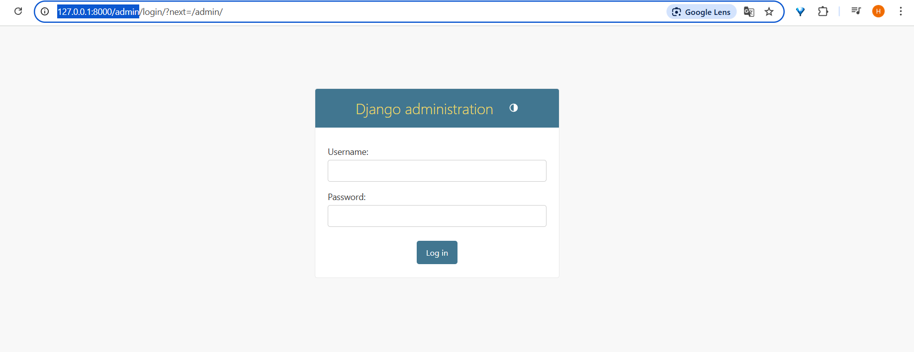
## go in the admin.py file and write this code to make the Category appear in the django admin page
```
from django.contrib import admin

# Register your models here.
from .models import Category,#Add Item Model here when you'll have created it`(see below)

admin.site.register(Category)
```
resultat :
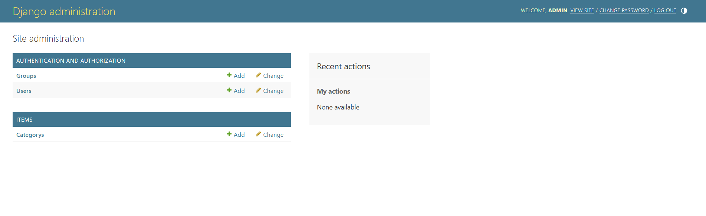
### To customise the name of  Category table let's add a meta class in its model class
```
    class Meta:
        # Add the alphabetic ordering code here (see his content below)
        verbose_name_plural = 'Categories' 
```
### As previously to return the table objects name instead of this picture names
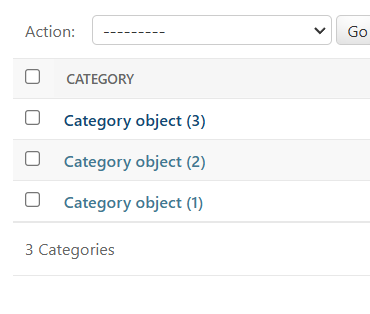
add the following code to the models of Category
```
def __str__(self):
        return self.name
```
Result: 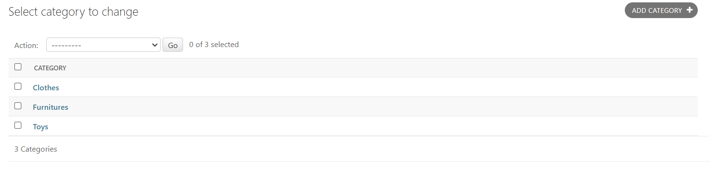
### Order the categories name in alphabetic order
Add this code to the meta class
```
ordering = ('name',)
```
## créer la classe Item dans le fichier items/models.py 
Installer le module Pillow:
```
    pip install Pillow
```
Ajouter cette ligne de code là dans les imports
```
from django.contrib.auth import User
```
Puis créer le model suivant:
```
class Item(models.Model):
    Category=models.ForeignKey(Category,related_name='items', on_delete=models.CASCADE)
    name=models.CharField(max_length=255)
    description=models.TextField(blank=True,null=True)
    price=models.FloatField()
    is_sold=models.BooleanField(default=False)
    created_at = models.DateField(auto_now_add=True)
    created_by=models.ForeignKey(User, related_name='items',on_delete=models.CASCADE)
    image=models.ImageField(upload_to='item_image',blank=True, null=True)
```
>Note: Partout ou il y a null=True, c'est ou l'utilisateur peut laisser le champ vide
et delete=models.CASCADE, signifie que si on supprime un User les items qui lui sont 
attribués seront supprimés aussi.

Then update the database by  making a migration and migrate it 
``` 
 python manage.py makemigrations  

```
The result of the migration in the console is :
 python manage.py makemigrations  
Migrations for 'items':
  items\migrations\0002_alter_category_options_item.py
    ~ Change Meta options on category
    + Create model Item
It as create an Item model ready to migrate in the database:
Let's migrate it:
```
 python manage.py migrate 
```
Then let's register it in the admin interface:
go in \items\admin.py and update the previous line which look like this at 80% to obtain this one:
```
from .models import Category,Item
```
Then add this line:
```
admin.site.register(Item)
```
Run the server again !
Go to the adminPage and you'll have the items their:
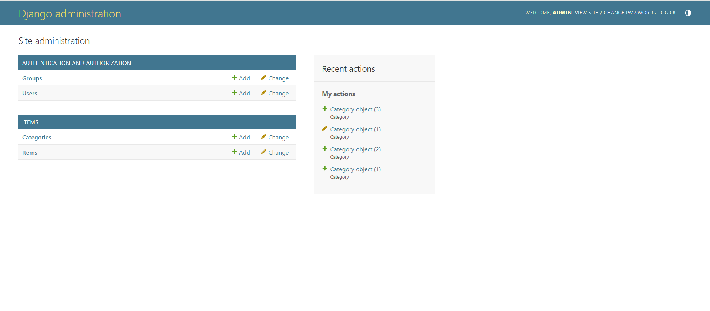
### Let's do some configurations for Images before creating our first Item:
And before we create anyone item we need to do some configurations, for Images
go to settings.py
And under thE STATIC_URL variable add those variable  for the media (which include images)

```
MEDIA_URL = 'media/'
MEDIA_ROOT = BASE_DIR/ 'media'
```
It will create a media folder at the root of the project,
because this code means that BASE_DIR is the root of the project
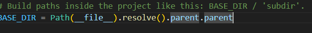

Now we can try to add some items:
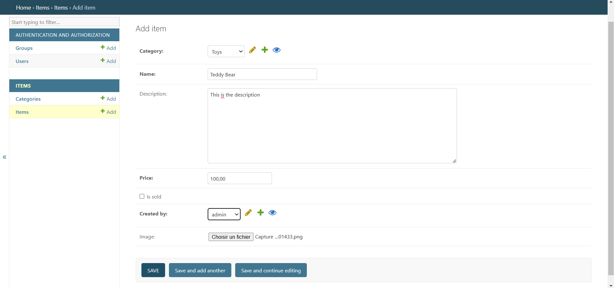
After adding those two items for example a media folder will apper in our file tree , it will contain their picture
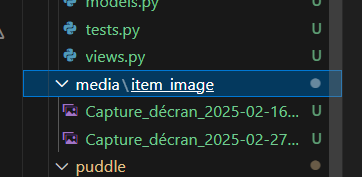

Then copy and add those two block of code so that you'll be able 
to see the item's name and order them by the alphabetical order 
```
 class Meta:
        ordering = ('name',)
        verbose_name_plural = 'Categories'
    def __str__(self):
        return self.name
```
Let's go in core/views.py:
To import the database models(Category and Item) there with those lines of code:
 ```
 from items.models import Category, Item
 ```
 ### Let's manage the displaying of Items and Categories on the index page
 Then update the request for displaying content on the index page with items and categories :
 ```
def index(request):
        items = Item.objects.filter(is_sold=False)[0:6]
        categories=Category.objects.all()
        return render(request, 'core/index.html', {
                'Categories':categories,
                'items':items
        })

```
Then let's go in the templates/index.html page and :
let's update our bloc content in the page to display our item on the page 
by modifying it to obtain the following code :
```


    <div class="mt-6 px-6 py-12 bg-gray-100 rounded-xl">
        <h2 class="mb-12 text-2xl text-center">Newest items</h2>
        <div class="grid grid-cols-3 gap-3">
            
                <div>
                    <a href="#">
                        <div>
                            
                        </div>

                        <div class="p-6 bg-white rounded-b-xl">
                            <h2 class="text-2xl">{{item.name}}</h2>
                            <p class="text-gray-500">Price:{{item.price}}</p>
                        </div>
                    </a>
                </div>
            
        </div>
    </div>

```
we obtain the following container in the body of our page :
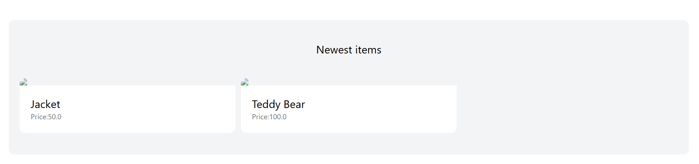

Let's the issue of non displaying pictures:
go in puddle/url.py
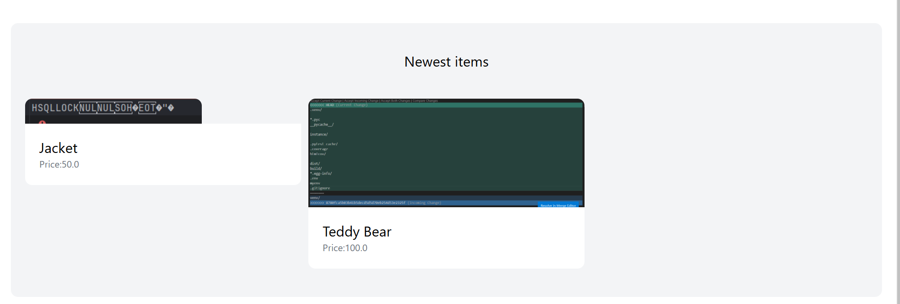
We will add the following modules and line of codes to obtain this previous picture of our items:
This configuration is just about settings the media variables to find our pictures 
first of all import those modules as the following code suggest:
```
from django.conf import settings
from django.conf.urls.static import static
```
Then use Them by modifiying the urlpatterns table in the file by adding the media_url and root to it 
thanks to an + symbol to obtain the following code;

```
urlpatterns = [
    path('', index,name='index'),
    path('contacts/', contact ,name='contact'),
    path('admin/', admin.site.urls),
] + static(settings.MEDIA_URL, document_root=settings.MEDIA_ROOT)
```
Then let's go back to the index page again and adding the following block of code to display
The categories and the number of Items they contains under the items bloc
like that:
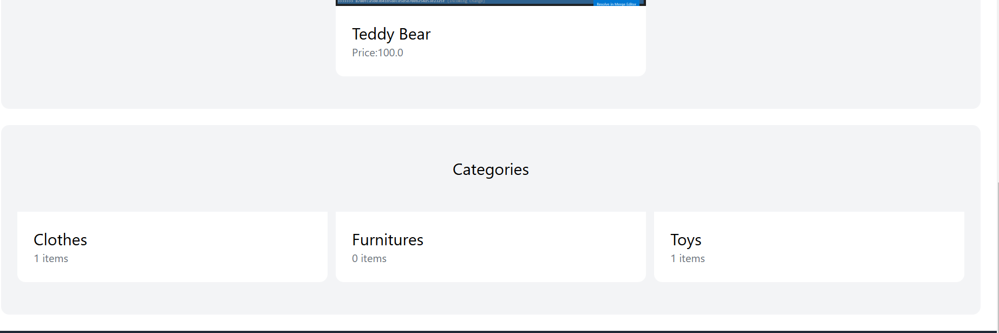
```
<div class="mt-6 px-6 py-12 bg-gray-100 rounded-xl">
        <h2 class="mb-12 text-2xl text-center">Categories</h2>
        <div class="grid grid-cols-3 gap-3">
            
                    <div>
                        <a href="#">
                            <div class="p-6 bg-white rounded-b-xl">
                                <h2 class="text-2xl">{{category.name}}</h2>
                                <p class="text-gray-500">{{category.items.count}} items</p>
                            </div>
                        </a>
                    </div>
            
        </div>
    </div>
```

